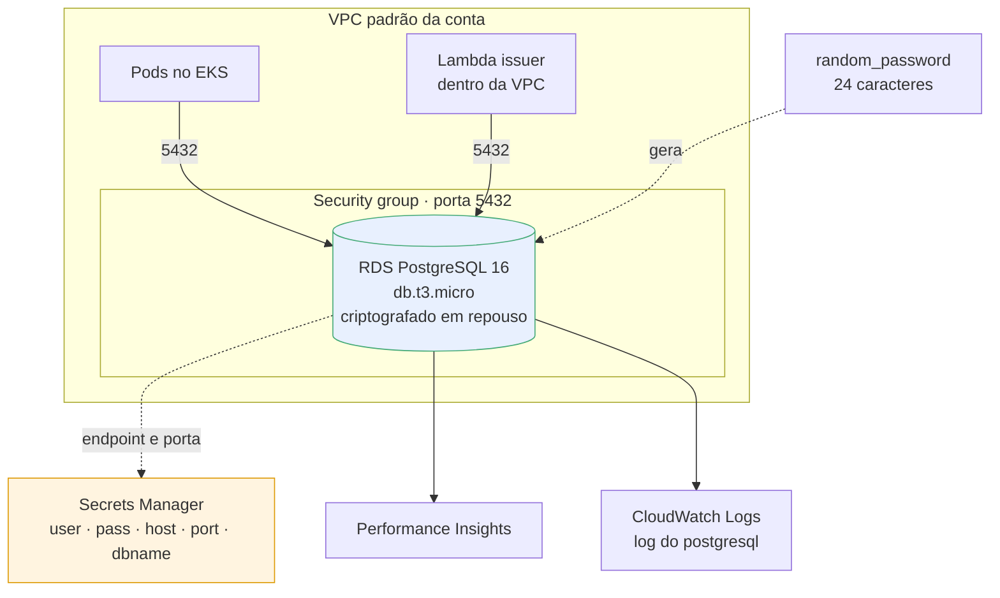
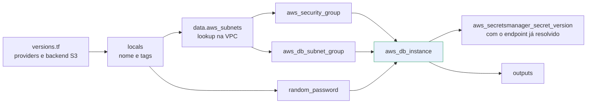
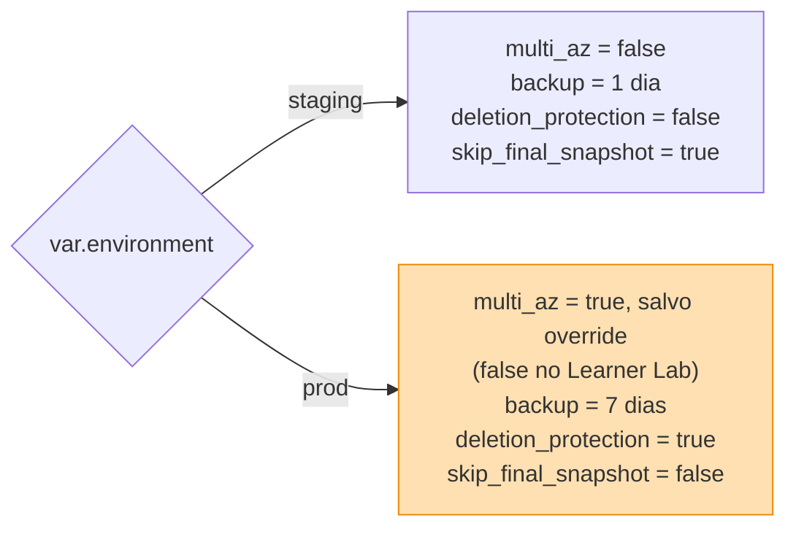

# postech-tc3-infra-database

Provisionamento do **banco de dados gerenciado** (Amazon RDS PostgreSQL 16) do sistema de gestão de oficinas mecânicas.

Tech Challenge Fase 3 — FIAP Pós Tech SOAT.

## Propósito

Este repositório é responsável apenas pela camada de dados: instância RDS, subnet group, security group e as credenciais no Secrets Manager. O cluster Kubernetes vive em [`postech-tc3-infra-k8s`](https://github.com/Kc1t/postech-tc3-infra-k8s). A aplicação e a Lambda recebem a string de conexão pelo GitHub Secret `POSTGRES_DSN`, montado com os outputs daqui.

## Tecnologias

- Terraform >= 1.5
- AWS: RDS PostgreSQL 16, Secrets Manager, VPC/Security Groups
- Backend de state: S3
- CI/CD: GitHub Actions com a credencial de sessão do AWS Academy Learner Lab
- Dockerfile: não se aplica — este repositório só provisiona infraestrutura

## Arquitetura



A instância **não é publicamente acessível**. O acesso vem de dentro da VPC: os pods do cluster e a Lambda de autenticação, que roda com `vpc_config` justamente para alcançar o banco sem sair para a internet.

A justificativa da escolha do banco, o diagrama ER e a explicação dos relacionamentos estão em [`MODELAGEM_DE_DADOS.md`](https://github.com/Kc1t/postech-tc3-app/blob/main/docs/MODELAGEM_DE_DADOS.md), no repositório da aplicação, que é dona do schema (`AutoMigrate` do GORM). As decisões estão no [RFC-0002](https://github.com/Kc1t/postech-tc3-app/blob/main/docs/rfc/0002-banco-gerenciado.md) e no [ADR-0003](https://github.com/Kc1t/postech-tc3-app/blob/main/docs/adr/0003-postgresql.md).

### Ciclo de vida dos recursos



A senha é gerada pelo Terraform e **nunca aparece em tfvars**. Ela vive no state e no Secrets Manager — por isso o state fica em S3, não em disco local.

## Estrutura

```
versions.tf    providers e backend
variables.tf   entradas
network.tf     subnet group + security group
main.tf        RDS, senha aleatória, secret
outputs.tf     endpoint, porta, ARN do secret
envs/          tfvars por ambiente (staging, prod)
```

## Deploy ativo

| O quê | Onde |
|---|---|
| Instância | `postech-tc3-prod-postgres` — RDS PostgreSQL 16, us-east-1, sem acesso público |
| Credenciais | Secrets Manager: `postech-tc3-prod-db-credentials` |
| API que usa o banco (Swagger) | https://tkh5cum8g8.execute-api.us-east-1.amazonaws.com/swagger/index.html |
| Collection Postman | [`postman_collection.json`](https://github.com/Kc1t/postech-tc3-app/blob/main/postman_collection.json) no repositório da aplicação |

A instância de produção foi criada na primeira validação no Learner Lab e importada para o state do Terraform (`terraform import`, chave `database/prod.tfstate`), com nome do security group, subnet group e senha preservados. Desde então quem a altera é o pipeline, no push da `main`.

## Execução local

```bash
terraform init \
  -backend-config="bucket=<seu-bucket-de-state>" \
  -backend-config="key=database/staging.tfstate" \
  -backend-config="region=us-east-1"

terraform plan  -var-file=envs/staging.tfvars
terraform apply -var-file=envs/staging.tfvars
```

Os dois `envs/*.tfvars` apontam para a VPC padrão da conta do Learner Lab (`vpc-05abad32762eabfe1`); troque o `vpc_id` ao usar outra conta.

## Deploy

| Evento | Ação |
|---|---|
| Pull Request | `fmt`, `validate`, `tfsec` e `plan` contra o state de produção |
| Push em `homolog` | `fmt`, `validate`, `tfsec` e `plan` automático contra o state de produção, sem apply — o banco é único e atende os dois namespaces ([ADR-0010](https://github.com/Kc1t/postech-tc3-app/blob/main/docs/adr/0010-cluster-unico-dois-namespaces.md)) |
| Push em `main` | `apply` em produção |

Secrets necessários no repositório: `AWS_ACCESS_KEY_ID`, `AWS_SECRET_ACCESS_KEY`, `AWS_SESSION_TOKEN`, `AWS_REGION` e `TF_STATE_BUCKET`.

## Outputs

| Output | Uso |
|---|---|
| `db_address` / `db_port` | conexão da aplicação |
| `db_credentials_secret_arn` | onde estão usuário e senha para montar o `POSTGRES_DSN` dos GitHub Secrets do app e da lambda |
| `db_security_group_id` | exposto para quem precisar liberar tráfego; hoje o security group libera a porta 5432 para os CIDRs da VPC (`allowed_cidr_blocks`) |

## Diferenças entre ambientes

Backup, proteção e Multi-AZ são derivados de `var.environment` no `main.tf`. A classe vem de `db_instance_class` (padrão `db.t3.micro`), e `multi_az` pode sobrescrever a regra:

| | staging | prod (regra do `main.tf`) | prod aplicado no Learner Lab |
|---|---|---|---|
| Multi-AZ | não | sim | **não** — `multi_az = false` no `envs/prod.tfvars` |
| Retenção de backup | 1 dia | 7 dias | 7 dias |
| Deletion protection | não | sim | sim |
| Final snapshot | pulado | obrigatório | obrigatório |
| Classe da instância | `db.t3.micro` | `db_instance_class` | `db.t3.micro` |

O `envs/prod.tfvars` força Single-AZ por orçamento. Para produção real, basta remover a linha `multi_az = false` e escolher uma classe maior.



> **Atenção ao destruir.** Em `prod`, `deletion_protection = true` faz o `terraform destroy` falhar de propósito. Para derrubar de verdade é preciso desligar a flag e aplicar antes. Isso é intencional: o `destroy` ao fim da sessão de trabalho deve atingir apenas staging.

## Custo

| Item | US$/hora | US$/mês 24/7 |
|---|---|---|
| `db.t3.micro` Single-AZ | 0,018 | 13,14 |
| 20 GB gp2 | — | 2,30 |
| Secrets Manager, 1 segredo | — | 0,40 |
| **Total staging** | **~0,018** | **~15,84** |

Rodando apenas durante as sessões de trabalho, o custo real dos 11 dias fica na casa de US$ 1. O que pesa no orçamento é o cluster, não o banco — ver [ADR-0010](https://github.com/Kc1t/postech-tc3-app/blob/main/docs/adr/0010-cluster-unico-dois-namespaces.md).
